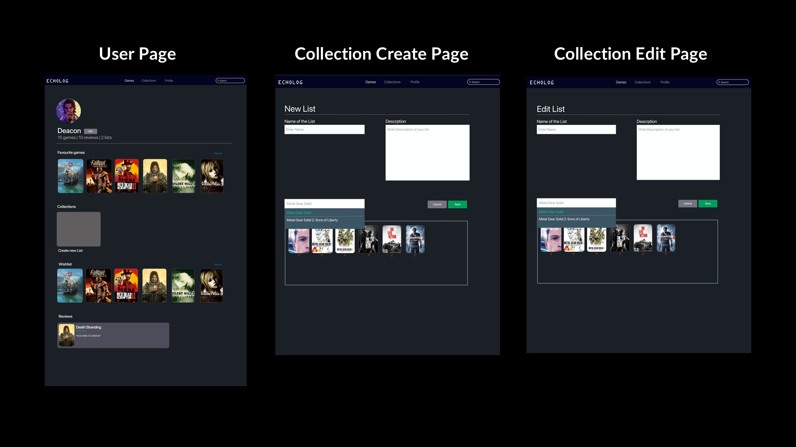

# Echolog

Games are more than just entertainment; they’re experiences. They tell stories, challenge us, and connect people across the globe. But with so many games out there, how do we decide which ones are worth our time? How do we find honest opinions and share our own voice in this vast games?
That’s where **ECHOLOG** comes in. We set out to build something simple, yet useful —a platform where gamers engage, express, and create collection of their favorite games. A space to discover games, rate them, review them, and help shape the gaming community in a meaningful way.

## Features

1- Discover Games Like Never Before

Explore a vast and diverse database of games, spanning from well-known AAA titles to hidden indie gems waiting to be discovered. Our platform allows you to effortlessly search and browse through a wide selection, with the ability to filter by genre, name, or platform. Whether you're looking for the latest blockbusters or unique, lesser-known gems, you'll find a tailored experience designed to help you discover and connect with the games, users, and collections that best suit your interests.

2- Collections/Playlists: That’s Where It Fun

Ever wish you could sort your games like you organize your music or movies? Now, you can. With our Collections feature, you have the power to create and name your own curated collections of your favorite games – just like on Spotify or Letterboxd. Whether you're a fan of genres, game franchises, or specific themes, you'll have an entirely new way to explore and organize your gaming world.

3- Real Reviews, Real Gamers

Users are free to review any game without concerns about restrictions. To ensure authenticity, reviews are verified, allowing each user to submit only one review per game. This guarantees genuine and honest feedback from the community.

4- Ratings that what matter

Users have the ability to create a personalized wishlist of games they plan to play in the future, including both upcoming releases and titles set to launch in the years ahead. This feature allows gamers to keep track of highly anticipated games and stay organized for future playthroughs.

5- Connect with the Community

Echolog is more than just a platform; it's a community. Users can follow each other, share their collections, and discover new games based on the recommendations of others. By connecting with like-minded gamers, you'll have the opportunity to explore new titles, share your thoughts, and engage with a community that shares your passion for gaming.

## Architecture

### Frontend

- The frontend consists of the HTML, CSS and JS used to design the user-facing side of the project. It handles user input(forms, buttons, etc.) and displays dynamic content fetched from the server.
- The client-side interacts with the backend via HTTP requests (using methods like GET, POST).
- To make flawless integration between front and back-end we used AJAX and Async

### Backend

- Pure PHP was used for the backend without any framework or library.
- The PHP scripts act as the bridge between the user interface and the database. The server processes requests, interacts with the database, and returns responses.
- PHP handles tasks such as form submissions, user authentication, data validation, and querying the database.

### Database

- The MySQL database stores all the data required for the application (e.g., user details, game info, playlist info, playlist games and so many).
- It uses structured tables with relationships (one-to-many, many-to-many) to ensure data is properly linked.

## Simplified Work Scheme

Client (User Interface) → HTTP Request (GET, POST) → Backend (PHP) → Database (MySQL) → Data Retrieval/Modification → Backend (PHP) → HTTP Response → Client (UI Update)

## Screenshots

[](./assets/presentation/screenshots-1.jpg)
[](./assets/presentation/screenshots-2.jpg)
[](./assets/presentation/screenshots-3.jpg)

## Installation

1. Clone the repository

   ```sh
   git clone https://github.com/Project-Echolog/echolog.git
   ```

2. Import the database

   - Create a new database in MySQL
   - Import the `EchoLog.sql` file located in the `sql` folder

3. Configure the database connection

   - Open the `dbconnection.php` file located in the `echolog` (root) folder
   - Update the database connection details (host, username, password, database name)

4. Start the server
   - You can use a local server like XAMPP, WAMP, or MAMP to run the project
   - Place the project folder in the server's root directory
   - Start the server and open the project in your browser

## Contributing

Contributions are what make the open-source community such an amazing place to learn, inspire, and create. Any contributions you make are **greatly appreciated**.

1. Fork the Project

2. Create your Feature Branch (`git checkout -b feature/AmazingFeature`)

3. Commit your Changes (`git commit -m 'Add some AmazingFeature'`)

4. Push to the Branch (`git push origin feature/AmazingFeature`)

5. Open a Pull Request

## License

Distributed under the GNU GPLv3 License. See `LICENSE` for more information.

## Preview

- [Project Link](https://github.com/Project-Echolog/echolog)
- [Website](http://echolog.wuaze.com/)

## Contributors

**Fakhri Khıdırzade**:

He was the project manager of the team, and also the owner of the main idea of ​​the project. He made the [Figma design](https://www.figma.com/design/hl5K6oBDZVY0kA62MOHXen/EchoLog?node-id=0-1&t=Rk7p773vL6ZLNBZ5-1) of the project, prepared the slide show and report. He created the database and database relations and created the connection between the database and the backend. He prepared the backend side of the project to a large extent.

You can visit his GitHub profile from [here](https://github.com/fxidirzade)

---

**Ubeyde Emir Özdemir**:

He looked after the works related to Git/GitHub (opening repo/organization, branch merging etc.), adapted the index, collection, browse collections, game page and profile page of the project from the Figma design and wrote the code. He took care of technical works such as XAMPP and Live server setup, FTP remote server connection.

You can visit his GitHub profile from [here](https://github.com/ubeydeozdmr)

---

**Tuana Albayrak**:

She wrote the code of the project's 404, (registered) games, browse games, create/edit list page pages by adapting them from Figma design.

You can visit her GitHub profile from [here](https://github.com/for-tuana)

---

**Arda Öztürk**:

He wrote the code of the project's game details (collections + liked users + reviews + wishlist users), login and register pages and add game to collections, add reviews to game, edit reviews of game pop-ups by adapting them from Figma design.

You can visit his GitHub profile from [here](https://github.com/arda03ozturk)
